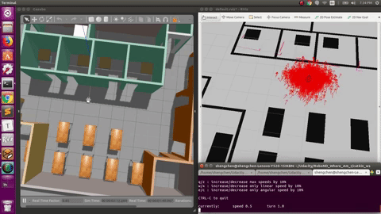

# Where Am I?



### 1. Initialize a workspace

```shell
cd ~/Udacity/RoboND_Where_Am_I/catkin_ws
catkin_make
source devel/setup.bash
```

### 2. Launch my_robot in Gazebo to load both the world and plugins

```shell
roslaunch my_robot world.launch
```

 ### 3. Open a new teminal and launch amcl node

```shell
cd ~/Udacity/RoboND_Where_Am_I/catkin_ws
catkin_make
source devel/setup.bash
roslaunch my_robot amcl.launch
```

### 4. Test

#### 4.1 Send 2D Navigation Goal

#### 4.2 Use teleop node

```shell
rosrun teleop_twist_keyboard teleop_twist_keyboard.py
```

